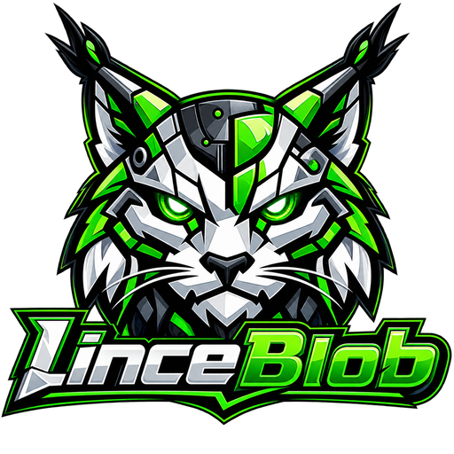

  

<h1 align="center">LinceBlob</h1>

  Envía archivos de un dispositivo a otro sin que pasen por la nube de nadie.

  <a href="https://lince.mibaltoalex.com/descargar/">Descargar</a> ·
  <a href="https://lince.mibaltoalex.com/documentacion/">Documentación</a> ·
  <a href="https://lince.mibaltoalex.com/">Web</a>

---

Cuando tienes que pasar un archivo grande a otro ordenador, lo normal es
subirlo a algún servicio, esperar, mandar el enlace y esperar otra vez
mientras el otro lo baja. El archivo hace dos viajes y se queda guardado en un
sitio que no controlas.

LinceBlob hace el viaje directo. Tu equipo se conecta con el otro y el archivo
pasa de uno a otro, cifrado, sin copia intermedia. No hay cuentas, no hay
registro y no hay límite de tamaño.

## Cómo funciona

Quien envía obtiene un código. Quien recibe lo pega. Ya está.

Ese código es la llave del contenido, así que conviene tratarlo como una
contraseña. Si los dos dispositivos están en la misma red, ni eso hace falta:
aparece el nombre del otro equipo, lo tocas y allí sale el aviso.

## Qué trae

- **Cifrado de extremo a extremo.** El contenido se cifra en tu dispositivo y se
  descifra en el de destino. Nadie por el camino puede leerlo.
- **Conexión directa.** Atraviesa routers y cortafuegos para unir los dos
  equipos. Cuando la red no lo permite, se pasa por un relé que reenvía datos
  ya cifrados y tampoco puede abrirlos.
- **Dispositivos cercanos.** En la misma red, enviar es elegir un nombre de
  una lista.
- **Código QR.** Del ordenador al móvil sin teclear nada: enseñas el QR, lo
  escaneas y la descarga arranca sola.
- **Reenvío de puertos.** Publica un servicio de tu equipo y ábrelo desde
  otro sitio como si estuvieras en su misma red.
- **Cifrado post-cuántico.** Para lo que tenga que seguir siendo secreto
  dentro de muchos años.
- **Cinco idiomas**: español, inglés, portugués, francés e italiano.

## Dónde funciona

| Sistema | Requisitos |
|---|---|
| Windows | Windows 10 o posterior, 64 bits |
| Linux | x86_64 y ARM. Paquetes `.deb`, `.rpm` y `.AppImage` |
| Android | Android 7 o posterior, incluido Android TV |

Las descargas están en la
[página de descargas](https://lince.mibaltoalex.com/descargar/) y en las
[releases](../../releases) de este repositorio.

## Sobre este repositorio

Aquí vive la web pública del proyecto y se publican las versiones. **El código
de la aplicación no se distribuye**: LinceBlob es software propietario y lo que
se reparte son los programas ya compilados.

- [Términos de uso](https://lince.mibaltoalex.com/terminos/)
- [Política de privacidad](https://lince.mibaltoalex.com/privacidad/)
- [Licencias de terceros](https://lince.mibaltoalex.com/licencias/)

Si quieres tocar la web, las instrucciones están en [WEB.md](WEB.md).

## Ayuda

¿Algo no va como debería? Abre una [incidencia](../../issues) contando qué
sistema usas, qué versión de LinceBlob y qué estabas haciendo. También puedes
escribir por Telegram a [@shellord_bot](https://t.me/shellord_bot).

## Autoría

Hecho por [Miguel J. Carmona (MIBALTOALEX)](https://me.mibaltoalex.com/).
